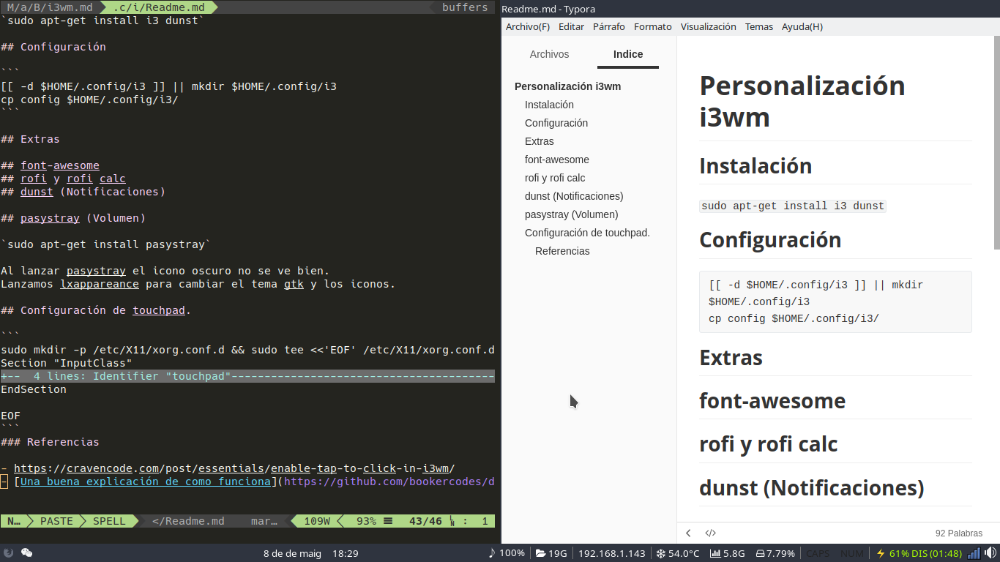
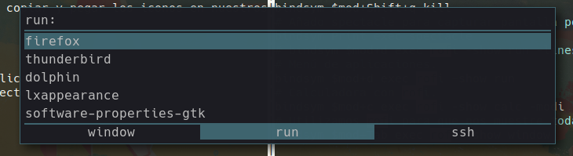
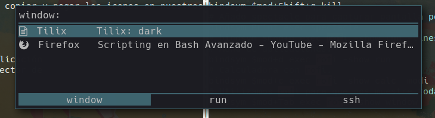
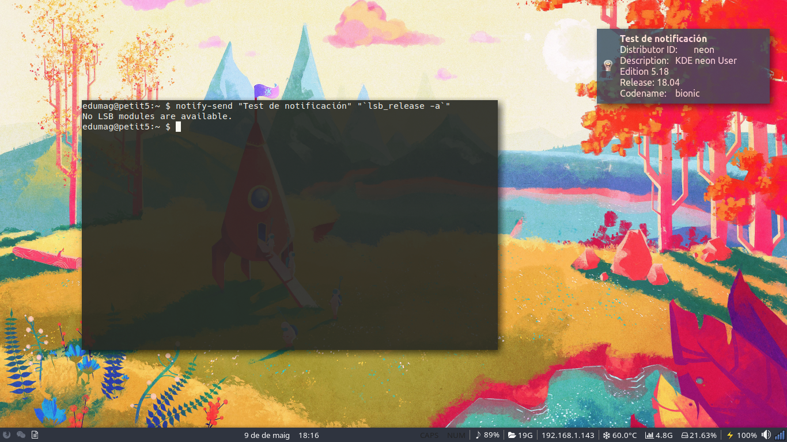
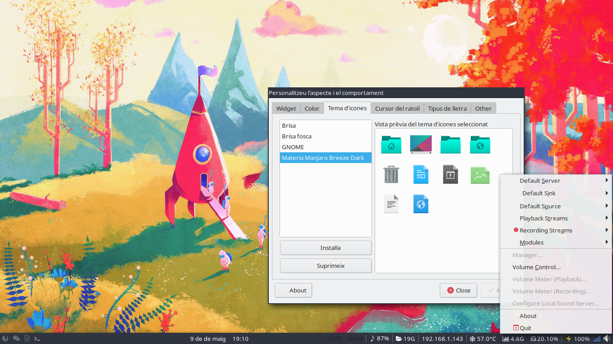

# Personalización i3wm



## Instalación

```bash
# Instalamos dependencias.
# debian o derivadas.
sudo apt-get install i3 dunst compton terminator feh rofi system-config-printer gdebi-core network-manager-gnome xrand keychain clipit

# arch o derivadas
sudo pacman -S i3 i3-gaps dunst terminator feh rofi xrand network-manager-applet keychain clipit

# Bajamos configuración.
git clone git@gitlab.com:edumag/i3-configuraci-n.git
mv i3-configuraci-n.git $HOME/.config/i3

# Instalamos font awesome.
wget https://github.com/creationix/boxcode/raw/master/font/fontawesome-webfont.ttf
[[ -d "$HOME/.fonts" ]] || mkdir $HOME/.fonts
mv fontawesome-webfont.ttf $HOME/.fonts/

# Fuente System San Francisco
wget https://github.com/supermarin/YosemiteSanFranciscoFont/blob/master/System%20San%20Francisco%20Display%20Regular.ttf?raw=true -o "$HOME/.fonts/System San Francisco Display Regular.ttf"

# Añadimos configuración propia a dunst
ln -s "$HOME/.config/i3/dunst" "$HOME/.config"

# Control de volumen
sudo apt-get install pasystray pavucontrol
```

### En caso de tener problemas con los bloques de i3bar

Los instalamos manualmente.

```
cd ~
git clone https://github.com/vivien/i3blocks-contrib.git
make install
rm -fr i3blocks-contrib
```

Los bloques se instalaran en ~/.local/libexec/i3blocks/

Reconfiguramos i3blocks en ~/.config/i3/i3blocks.conf

```
# command=/usr/share/i3blocks/$BLOCK_NAME
command=~/.local/libexec/i3blocks/$BLOCK_NAME
```

## Editar gtk

```
lxappearance
```

## Combinación de teclas básica

| Combinación      | Acción                                      |
| ---------------- | ------------------------------------------- |
| Mod+Enter        | Terminal                                    |
| Mod+Shift+Q      | Cerrar centana                              |
| Mod+d            | Lanzador aplicaciones                       |
| Mod+Space        | Cambiar ventana a modo flotante             |
| Mod+r            | Redimensionar ventana                       |
| Mod+Alt_L        | Seleccionar ventana con Rofi                |
| Mod+Shift+Flecha | Mover ventana de posición                   |
| Mod+w            | Cambio de disposición de ventanas (Layouts) |
| Mod+Flecha       | Cambiamos foco de ventana                   |
| Mod+f            | FullScreen                                  |
| Mod+p            | Gestión de impresoras                       |

## font-awesome

[Font Awesome Free's Cheatsheet](https://fontawesome.com/cheatsheet?from=io)

Desde la web de fontawesome podemos copiar y pegar los iconos en nuestros
ficheros de configuración

## Rofi

Instalamos rofi como lanzador de aplicación
y de paso tenemos calculadora y selector de
ventanas.

### Seleccionar tema.

rofi-theme-selector

### Menú de aplicaciones (Mod+d)



### Calculadora (Mod+c)


### Seleccionar ventana. (Mod+Tab_L)



## dunst (Notificaciones)



## pasystray (Volumen)

Al lanzar pasystray el icono oscuro no se ve bien.
Lanzamos lxappareance para cambiar el tema gtk y los iconos.



## Configuración de touchpad.

```
sudo mkdir -p /etc/X11/xorg.conf.d && sudo tee <<'EOF' /etc/X11/xorg.conf.d/90-touchpad.conf 1> /dev/null
Section "InputClass"
        Identifier "touchpad"
        MatchIsTouchpad "on"
        Driver "libinput"
        Option "Tapping" "on"
EndSection

EOF
```
### Referencias

- https://cravencode.com/post/essentials/enable-tap-to-click-in-i3wm/

## Configuración de gtk-3

He tenido problemas con algunos textos de los botones que no se muestran en las aplicaciones gnome que utilizan gtk3.

Para solucionarlo he creado el fichero .config/gtk-3.0/settings.ini y añadido:

```
[Settings]
gtk-icon-theme-name = Adwaita
gtk-theme-name = Adwaita
gtk-font-name = DejaVu Sans 11
gtk-theme-name=Arc-Dark
gtk-icon-theme-name=breeze-dark
gtk-font-name=Sans 11
gtk-cursor-theme-name=Breeze_Amber
gtk-cursor-theme-size=0
gtk-toolbar-style=GTK_TOOLBAR_BOTH_HORIZ
gtk-toolbar-icon-size=GTK_ICON_SIZE_SMALL_TOOLBAR
gtk-button-images=0
gtk-menu-images=0
gtk-enable-event-sounds=0
gtk-enable-input-feedback-sounds=0
gtk-xft-antialias=1
gtk-xft-hinting=1
gtk-xft-hintstyle=hintslight
gtk-xft-rgba=rgb
# gtk-decoration-layout=menu:close
# gtk-application-prefer-dark-theme=1

```

## Control de brillo

### Instalar light

Bajar paquete deb de https://github.com/haikarainen/light/releases e instalar.

```
sudo apt install gdebi-core light_*.deb
```

No he podido encontrar ninguna aplicación que me funcione, al final he realizado un simple script que hace la función.

> $ ./brightness.sh -h
>
> uso: brightness.sh [+|-]

En mi caso:

Añadir "acpi_backlight=vendor" a la linea

```
GRUB_CMDLINE_LINUX_DEFAULT="quiet splash"
```

en /etc/default/grub y ejecutamos

`sudo update-grub2.`

Permitimos ejecutar script sin pedir contraseña desde sudo:

```
echo "$USER   ALL=(root) NOPASSWD: $HOME/.config/i3/brightness.sh" | sudo tee /etc/sudoers.d/brightness
```

## Aplicaciones por defecto.

```
vim .config/mimeapps.list
```

## Referencias

- [Una buena explicación de como funciona](https://github.com/bookercodes/dotfiles.git)
- https://sergioquijanorey.github.io/i3/linux/programacion/administracion/2018/09/09/configuraci%C3%B3n-i3wm.html


## Reemplazar i3-wm por i3-gaps

```
sudo add-apt-repository -y ppa:regolith-linux/stable
sudo apt install i3-gaps
```

## Reemplazar i3-gaps por i3-radius

https://terminalroot.com/how-to-install-i3-gaps-with-rounded-corners/


