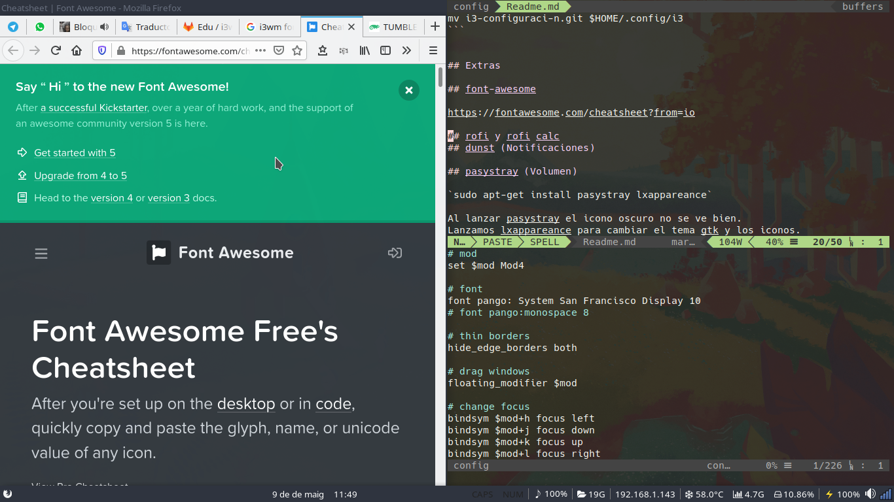
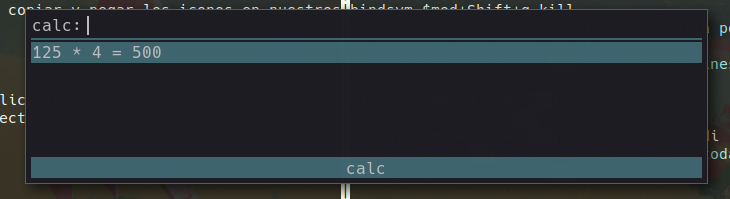

# Personalización i3wm



## Instalación

### debian o derivadas.

    sudo apt-get install i3 dunst compton terminator feh rofi system-config-printer gdebi-core network-manager-gnome xrand keychain clipit pasystray ksip

### arch o derivadas

    sudo pacman -S i3 i3-gaps dunst terminator feh rofi xrand network-manager-applet keychain clipit sysstat pasystray ksnip

### Bajamos configuración.

    git clone git@gitlab.com:edumag/i3-configuraci-n.git
    mv i3-configuraci-n.git $HOME/.config/i3

### Instalamos font awesome.

    wget https://github.com/creationix/boxcode/raw/master/font/fontawesome-webfont.ttf
    [[ -d "$HOME/.fonts" ]] || mkdir $HOME/.fonts
    mv fontawesome-webfont.ttf $HOME/.fonts/

### Fuente System San Francisco

    wget https://github.com/supermarin/YosemiteSanFranciscoFont/blob/master/System%20San%20Francisco%20Display%20Regular.ttf?raw=true -o "$HOME/.fonts/System San Francisco Display Regular.ttf"

### Servidor de notificaciones

En caso de tener un servidor ya activado deberá sustituirse.

Se ejecuta el servidor desde /usr/share/dbus-1/services/org.freedesktop.Notifications.service

    [D-BUS Service]
    Name=org.freedesktop.Notifications
    Exec=/usr/bin/dunst
    SystemdService=dunst.service
    exec --no-startup-id dunst

#### Añadimos configuración propia a dunst

    ln -s "$HOME/.config/i3/dunst" "$HOME/.config"

## Editar gtk

```
lxappearance
```

## Combinación de teclas básica

| Combinación      | Acción                                      |
| ---------------- | ------------------------------------------- |
| Mod+Enter        | Terminal                                    |
| Mod+Shift+Q      | Cerrar centana                              |
| Mod+d            | Lanzador aplicaciones                       |
| Mod+Space        | Cambiar ventana a modo flotante             |
| Mod+r            | Redimensionar ventana                       |
| Mod+Alt_L        | Seleccionar ventana con Rofi                |
| Mod+Shift+Flecha | Mover ventana de posición                   |
| Mod+w            | Cambio de disposición de ventanas (Layouts) |
| Mod+Flecha       | Cambiamos foco de ventana                   |
| Mod+f            | FullScreen                                  |
| Mod+p            | Gestión de impresoras                       |

## font-awesome

[Font Awesome Free's Cheatsheet](https://fontawesome.com/cheatsheet?from=io)

Desde la web de fontawesome podemos copiar y pegar los iconos en nuestros
ficheros de configuración

## Rofi

Instalamos rofi como lanzador de aplicación
y de paso tenemos calculadora y selector de
ventanas.

### Seleccionar tema.

rofi-theme-selector

### Menú de aplicaciones (Mod+d)


### Calculadora (Mod+c)



### Seleccionar ventana. (Mod+Tab_L)


### Referencias

- https://cravencode.com/post/essentials/enable-tap-to-click-in-i3wm/

## Control de brillo

Utilizamos script propio para el control de brillo con xrand.

Configuramos tecla de brillo + shift para segunda pantalla.

## Aplicaciones por defecto.

```
vim .config/mimeapps.list
```

## Referencias

- [Una buena explicación de como funciona](https://github.com/bookercodes/dotfiles.git)
- https://sergioquijanorey.github.io/i3/linux/programacion/administracion/2018/09/09/configuraci%C3%B3n-i3wm.html

